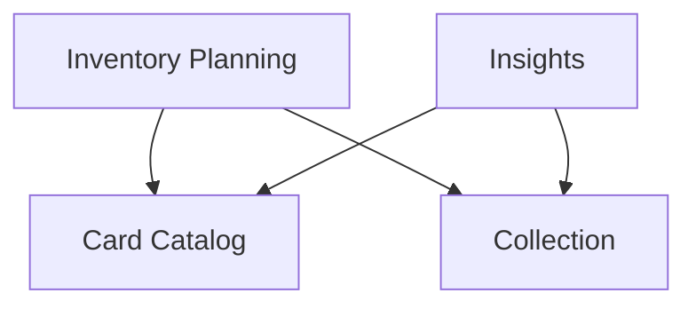

# Backend Architecture

Full rationale for the server's structure. The actionable subset an agent must
obey lives in [server/AGENTS.md](../../server/AGENTS.md); this document explains
*why* those rules exist and records the deliberate exceptions. The decision
history behind the big calls — alternatives considered and why they lost —
lives in the ADRs under [docs/decisions/](../decisions/README.md).

Code is organized **context-first, then layer**:
`server/src/<bounded_context>/{domain,application/{commands,queries},infrastructure/{adapters,daos},driver/{skir,http}}/`.
Strict hexagonal layers apply within and across contexts — each layer may only
import itself and layers below it: `domain` → `application` →
`infrastructure`/`driver` → `composition`. `shared/domain` is available
everywhere.

Four bounded contexts under `server/src/`: **card_catalog**, **collection**,
**inventory_planning**, **insights**. Planning preferences (default
sort/grouping) live inside inventory_planning — there is no separate Settings
context. Target-set / completion-tracking preferences live inside insights
instead — see the boundary note in
[domain-ubiquitous-language.md](domain-ubiquitous-language.md), which also owns
the domain vocabulary and context ownership rules.

## Cross-Context Dependencies

Which context may depend on which is enforced by the lint rule in
`server/test/lint.gleam` (`allowed_cross_bc`) — this section mirrors that
allowlist, the lint is the source of truth. Keep the diagram in sync when the
list changes.

- **Card Catalog** and **Collection** are upstream: they depend on no other context.
- **Inventory Planning** and **Insights** are downstream consumers of both.

A cross-BC dependency is only legal in one shape: the consumer's
`infrastructure/` importing the provider's `driver/gleam/` facade
(`is_cross_bc_link` in the lint). Everything else — including the shared
kernel under `shared/` and the `bootstrap/` composition root — is not a
context-to-context dependency and stays out of this diagram. Additions must
stay explicit one-to-one context pairs — no wildcards or blanket layer
bypasses.

## Lint Enforcement

`just server::lint-check` runs `gleam run -m lint` (glinter via the
`glinter_arch` git dependency, from the `gleam-libs` repo) which applies a
custom `depends_only_on` rule. Violations are build errors. Decision record:
[ADR 0001](../decisions/0001-lint-enforced-hexagonal-bounded-contexts.md).

- **Bounded context isolation**: contexts must not import from each other,
  except via the cross-BC allowlist above. Only `bootstrap/composition` wires
  them together unconditionally.
- **Layer ordering**: within any context (and within `shared/`), imports may
  only go inward — `driver`/`infrastructure` may import `application` and
  `domain`, but not the reverse.
- **`driver/gleam/` is a cross-BC Gleam API layer** (`GleamDriver`): a thin
  facade that exposes a BC's capabilities to other BCs. Regular `driver/http/`
  and `driver/skir/` remain transport-only and are never cross-BC.
  `GleamDriver` may import its own BC's `domain`, `application`, and
  `infrastructure` — routing through the owning BC's query handler and
  adapter, not straight into the DAO, so it returns typed read models instead
  of raw tuples. **Known gap**: `glinter_arch` (pulled in from the separate
  `gleam-libs` repo) doesn't yet encode the Driver→own-BC-Infrastructure
  exception this rule describes, so `driver/gleam/*.gleam` files currently
  carry a `// nolint: depends_only_on` on the infrastructure import. Fixing
  the rule itself means changing that repo.
- **`shared/` is a shared kernel**: any bounded context may import `shared/`,
  but `shared/` must not import bounded contexts. Layer rules apply within
  `shared/` too.
- **`bootstrap/` is the composition root**: it may import anything. Only
  `driver/` may import `bootstrap/` (DI injection seam).
- **Generated skir code** (`src/shared/driver/skir/skirout/`) is linted like
  handwritten code — it categorizes as shared `Driver(Skir)` and there is no
  lint exclusion. Only `gleam format` skips it (the
  `find ... ! -path '*/skirout/*'` in `server/justfile`).

## Request Flows

All four bounded contexts share the same driver pattern: drivers call use-case
handlers directly — there is no intermediate application facade. Result mapping
from domain types to RPC types lives in `driver/skir/codec.gleam`; route
handlers and JSON encoding/decoding live in `driver/http/handler.gleam` and
`driver/http/json_codec.gleam`.

**skir**: `skir-src/*.skir` → generated `server/src/shared/driver/skir/skirout/`
→ `server/src/<context>/driver/skir/handler.gleam` → use-case handler →
use-case port → domain + infrastructure.

**http**: `bootstrap/http/app_server.gleam` routing table →
`server/src/<context>/driver/http/handler.gleam` → use-case handler → use-case
port → domain + infrastructure.

## Two Transports, Deliberately

skir (contract-first RPC) is the primary, well-typed API the client-web app
uses. A parallel REST API exists for third-party/scripted access where
requiring the skir client isn't practical — it is not legacy and both are
expected to stay. Because of this, a use case that has externally-visible side
effects (e.g. spawning a background worker) must put that orchestration in a
shared module both drivers call (e.g.
`card_catalog/driver/refresh_launcher.gleam`), not duplicate it per transport —
the two doors must behave identically, they just speak different wire formats.
Decision record:
[ADR 0004](../decisions/0004-keep-parallel-rest-api-alongside-skir.md).

## Shared Code and Bootstrap

Shared cross-context code lives under `server/src/shared/`:

- `shared/domain/` — shared kernel (`card_key`, `non_empty_string`); pure, no I/O.
- `shared/application/command_result.gleam` — shared app type.
- `shared/infrastructure/` — `os_runtime` (raw `os:cmd`/`getenv`),
  `shell.gleam` (subprocess wrapper), `stores/sqlite_store.gleam`
  (parameterized queries over `sqlight`).
- `shared/driver/` — `http/{helpers,json_codec}.gleam` (generic response
  helpers, shared encoders/decoders), `http/static_files.gleam` (SPA/static
  file serving, path sanitisation), `skir/skirout/` (generated contract code —
  never edit, run `just skir-gen`).

Database access objects for each context live in
`<context>/infrastructure/daos/`. The composition layer under
`server/src/bootstrap/`: `bootstrap/skir/{router,setup}.gleam` (skir server
loop + thin `make_service()` chaining context registers),
`bootstrap/http/app_server.gleam` (mist bootstrap, routing table),
`bootstrap/composition.gleam` (DI wiring root).

## Application Layer

CQRS: commands and queries are strictly separated. Commands:
`<context>/application/commands/<command>/`, queries:
`<context>/application/queries/<query>/`. Each use case has its own
`handler.gleam` (command/query type + `execute`) and `ports.gleam` (port
interfaces + errors). Naming is operation-first — `RefreshCatalogCommand`,
`ListCatalogCardsQuery`, `RefreshCatalogPorts`.

**Port naming and structure.** A use case that depends on a **single
capability** defines one `*Port` type (e.g. `ListCatalogCardsPort`). A use
case that depends on **multiple capabilities** defines individual named port
types and bundles them in a `*Ports` aggregate record (e.g.
`RefreshCatalogPorts`). Each port is either:

- A `fn`-type alias (`pub type NowPort = fn() -> Timestamp`) for a single-op port.
- A small record for a cohesively-grouped multi-op port (e.g.
  `RefreshRecordRepositoryPort` with `load`/`save` — the aggregate's
  consistency boundary).

Ports are **capability-narrow**: each function declares only what the use case
needs. Reuse belongs in the infrastructure layer behind adapters, not in
widened port signatures. No sharing of repository ports across use cases —
each use case owns its own port definitions.

**Adapters wire one typed function per port** and assemble the `*Ports`
record. Each per-port adapter function carries the port type alias as its
return type annotation.

**Handlers own orchestration — for commands.** A command's `execute` must not
be an empty pass-through to a single `ports.execute()` god-method; it contains
the use-case logic (branching, sequencing, error mapping) and composes the
individual ports from the `*Ports` bundle. **Queries are exempt**: a query
handler that is a one-line `port.f()` (e.g. `ListCatalogCardsQuery`,
`GetPlanningPreferencesQuery`) is not hiding logic — there just isn't any —
and is the CQRS-orthodox shape for a read that has nothing to branch on.
Don't invent branching in a query handler just to avoid looking thin.

## Infrastructure Layer

**Injected-IO seam for testability.** Adapters that make network calls accept
a seam type (e.g. `scryfall_client.Downloader`) holding the outbound I/O as a
closure, injected via a `new_with_*` constructor. `new()` calls
`new_with_*(live_*())` for production. This lets integration tests pass a
hermetic fake without touching `composition.gleam`.

## Database

SQLite via `sqlight` (parameterized queries, typed decoders) through
`shared/infrastructure/stores/sqlite_store.gleam` — DAOs should not build SQL
by string-interpolating values; use `?` placeholders and
`sqlight.text`/`sqlight.int`/`sqlight.nullable`. Set `TCG_DB_FILE` to the db
path. Run migrations with `just dbmate-migrate`. (Deliberate exceptions are
documented in the owning context's AGENTS.md — currently only
`card_catalog`'s `bulk_load`,
[ADR 0005](../decisions/0005-bulk-load-via-sqlite3-cli-import.md).)

**Error handling philosophy.** Write ports return `Result(Nil, String)`; the
calling handler decides what a persistence failure means for its use case
(e.g. a failed `replace_collection` write fails the whole import and surfaces
as a 500, since a partially-written collection would be worse than a rejected
one). Read ports are equally fallible — `fn() -> Result(a, String)` (or
`Result(Option(a), String)` when absence is itself a valid outcome) — so a
broken query surfaces as an error instead of defaulting to "empty"/"not
found". A read port may only collapse its error to a default when the call
site can prove the two are truly indistinguishable to every consumer; when in
doubt, propagate.
