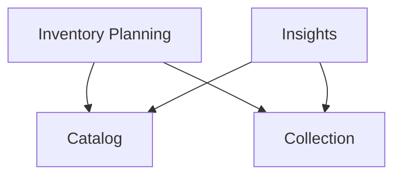

# Bounded Context Dependencies

The server has four bounded contexts. Which context may depend on which is
enforced by the lint rule in `server/test/lint.gleam` (`allowed_cross_bc`) —
this document mirrors that allowlist, the lint is the source of truth.

- **Catalog** and **Collection** are upstream: they depend on no other context.
- **Inventory Planning** and **Insights** are downstream consumers of both.

A cross-BC dependency is only legal in one shape: the consumer's
`infrastructure/` importing the provider's `driver/gleam/` facade
(`is_cross_bc_link` in the lint). Everything else — including the shared
kernel under `shared/` and the `bootstrap/` composition root — is not a
context-to-context dependency and stays out of this diagram.
