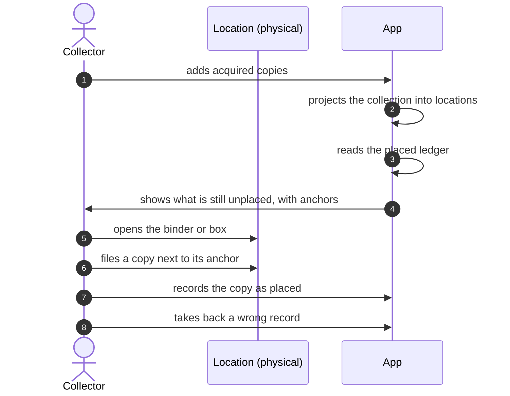
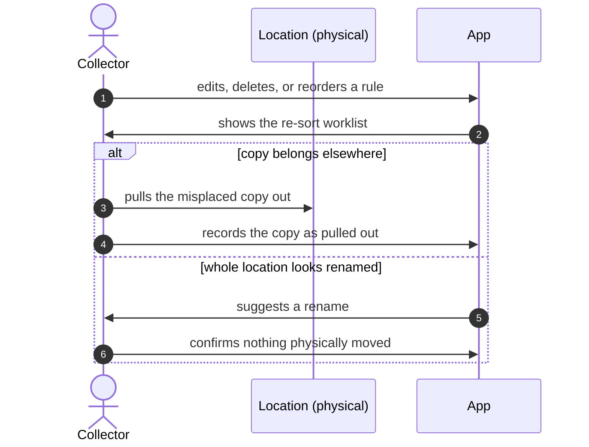
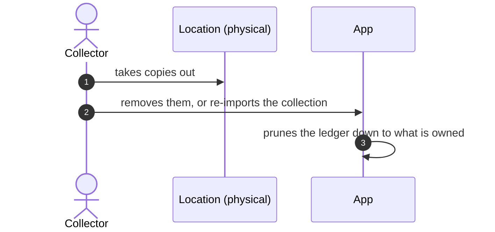

# Filing Cards

*As-is · fine-grained · digitalized.* Goal: the copies physically in each location
match what the placed ledger records there, and both match the projection.

Actors: **Collector**, **App**. Work objects: copy, collection, location (a physical
binder or box), projection, placed ledger, placement guidance, re-sort worklist.

Precondition: the Collector has rules and a bulk spec (story *Designing the sorting
scheme* — not yet written).

## 1. Filing newly acquired copies

1. The Collector adds acquired copies to the collection. [cmd: collection/add_cards]
2. The App projects the collection through the rule cascade into locations.
   [query: inventory_planning/projection]
3. The App reads the placed ledger. [query: inventory_planning/placed_ledger]
4. The App derives placement guidance: per location, the copies still unplaced, each
   with its nearest already-placed neighbours as physical anchors.
   [derived: client-web/src/data/placement/guidance.ts]
5. The Collector picks a location and opens the physical binder or box.
6. The Collector files a copy next to its anchor.
7. The Collector records the copy as placed — singly, or a whole filed stretch at
   once. [cmd: inventory_planning/mark_cards_placed]
8. The Collector notices a wrong record and takes it back — singly, or a whole stretch
   at once. [cmd: inventory_planning/unmark_cards_placed]

> **Gap:** nothing checks that a location's physical contents match the ledger; a
> mis-filed copy stays recorded as correct. [#108](https://github.com/NicoVIII/tcg-card-collector/issues/108)

## 2. Re-sorting after the rules changed

1. The Collector edits, deletes, or reorders a rule.
   [cmd: inventory_planning/upsert_rule] [cmd: inventory_planning/delete_rule]
   [cmd: inventory_planning/reorder_rules]

> **Gap:** the App does not warn that the change strands already-placed copies; the
> Collector finds out afterwards in step 2. [#124](https://github.com/NicoVIII/tcg-card-collector/issues/124)

2. The App re-projects and derives the re-sort worklist: Misplaced copies grouped by
   their stale location, each with the locations where it is now Unplaced.
   [derived: client-web/src/data/placement/resort.ts]
3. The Collector pulls a misplaced copy out of its stale location.
4. The Collector records it as pulled out; the App forgets that placement, so the copy
   re-enters guidance for its new location (story 1, step 4).
   [cmd: inventory_planning/unmark_cards_placed]

Alternatively, when a whole stale location vanished and all its copies share one
destination:

5. The App suggests a rename.
6. The Collector confirms nothing physically moved; the App re-points the location's
   ledger rows. [cmd: inventory_planning/relocate_placed_cards]

## 3. Copies leave the collection

1. The Collector takes copies out of their locations (sold, traded, moved to a deck).
2. The Collector removes them from the collection — or replaces the collection with a
   fresh CSV import. [cmd: collection/remove_cards] [cmd: collection/import_collection]

> **Gap:** the App does not show where the removed copies are recorded as placed; the
> Collector has to know or search. [#158](https://github.com/NicoVIII/tcg-card-collector/issues/158)

3. The collection announces it changed; the App prunes the ledger wherever more copies
   are placed than owned. [cmd: inventory_planning/reconcile_placed_ledger]

> **Gap:** the App prunes locations in alphabetical order, not the location the
> Collector took the copy from. With copies placed in A and B and the copy taken from
> B, the ledger keeps B. If the remaining copy projects to A, guidance asks to file a
> copy into A that is already there, and the re-sort worklist sends the Collector to
> pull a copy out of B that is gone. [#158](https://github.com/NicoVIII/tcg-card-collector/issues/158)

## Coverage

Inventory Planning handlers referenced: `mark_cards_placed`, `unmark_cards_placed`,
`relocate_placed_cards`, `reconcile_placed_ledger`, `upsert_rule`, `delete_rule`,
`reorder_rules`, `projection`, `placed_ledger`.

Owed by other stories: `list_rules`, `get_bulk_spec`, `update_bulk_spec`
(*Designing the sorting scheme*), `restore_plan` (*Backing up and restoring*).
